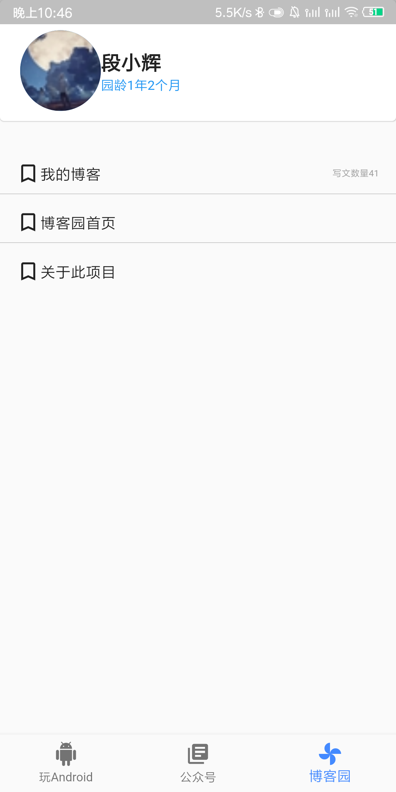

这个是一个基于flutter 构建的博文查看app。

### 为什么做这样一个app

因为这个学期我们专业在学习安卓，而安卓我又刚好会一点，所以想挑战学习新的技术和知识，so，花了1个晚上学习了一下flutter的
基本语法，然后参考了这个[项目](https://github.com/shijiacheng/wanandroid_flutter)，因此在这个项目中代码写的特
别的奇怪（~~辣鸡~~），会慢慢的修改，万一重构了呢？

### 项目介绍
这个项目还是比较简单的，没有复杂的页面和逻辑，实际上也没什么界面。只能说持续更新吧

| 首页 | 博客园的页面，必须登录才有这些东西 |
| ---- | ---- |
|      |      |

### app所用到的api

1. 博客园api
[博客园API地址](https://api.cnblogs.com输入法【】、)

2. 玩安卓api

[玩安卓API地址](https://www.wanandroid.com/blog/show/2)

### 参考资料

1. 在这里感谢[技术胖](http://jspang.com/)提供的学习资料，其中教程都比较简单，特别适合入门。
2. [flutter中国](https://flutter.cn/)

